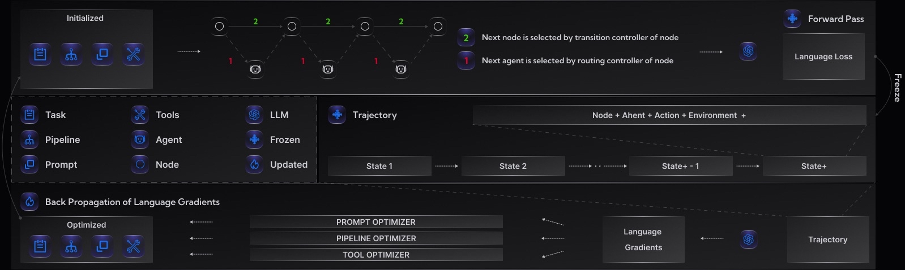

# :brain: Yoro: Agent Symbolic Learning Framework

 <!-- Replace with your actual banner image path -->

**Yoro** is a symbolic learning framework for training language agents, inspired by the **connectionist learning** approach used in neural networks. It reimagines agent training through an analogy to neural nets, implementing forward passes, backpropagation, and gradient updates using prompts and language-based mechanisms.

---

## :globe_with_meridians: Concept

Yoro draws parallels between neural networks and language agents:

- The **agent pipeline** ↔ the **computational graph** of a neural net.
- A **node** in the pipeline ↔ a **layer** in the net.
- **Prompts and tools** ↔ **weights** of a layer.

Using this structure, Yoro implements the key components of learning:
- **Forward pass**: Agent executes a task.
- **Language loss**: Computed via prompts.
- **Backpropagation**: Reflections generate symbolic "language gradients".
- **Update step**: Prompts and tools are refined accordingly.

---

## :repeat: Workflow

Yoro's training process follows a symbolic version of neural network learning:

1. **Forward Pass**:  
   - Agent performs a task using a pipeline of nodes.  
   - Inputs, outputs, prompts, and tools are stored in a "trajectory".

2. **Loss Computation**:  
   - A **prompt-based loss function** evaluates the result.
   - Generates a **language loss**.

3. **Backpropagation**:  
   - The loss is propagated backward through each node.
   - Each node produces **language gradients**—textual analyses and reflections.

4. **Optimization**:  
   - Prompts, tools, and the overall pipeline structure are updated via language-based optimizers.

5. **Multi-Agent Support**:  
   - Nodes may represent separate agents.
   - Multiple agents can act within a single node, enabling flexible collaboration.

---

## :bar_chart: Workflow Illustration

 <!-- Replace with your actual workflow image path -->

---

## :tools: Installation

### From GitHub

```bash
pip install git+https://github.com/YoroFramework/Yoro